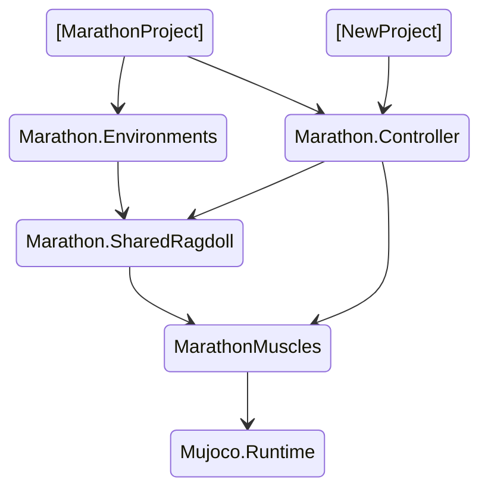

# README

This folder contains the backbone of the Marathon project.

It is organized in 3 subfolders:

- marathon.controller contains all the scripts used for the marathon contrller

- marathon.ragdoll contains assets used to define the ragdolls, also for the older Marathon Environments 

- marathon.muscles defines what are motor update rules and interfaces to connect to both Mujoco (through *MjMuscles*) and PhysX (through *ArticulationBody*).

Each subfolder is organised as an assembly. The packages are also organized to allow a relatively simple implementation in a new Unity project. Specifically, the dependency of assemblies is as follows:

The packages *Marathon.SharedRagdoll*, *Marathon.Controller* and *MarathonMuscles* are stored in repository [GitHub - joanllobera/marathon-basics](https://github.com/joanllobera/marathon-basics)

The scripts in MarathonMuscles are contributions from github user **Balint-H**

There is a public version of the Marathon project that imports it and use  it as  apropriate Unity3D assemblies [here](https://github.com/joanllobera/marathon-envs/tree/feature/mujoco+LSPD) (as of May 2022).